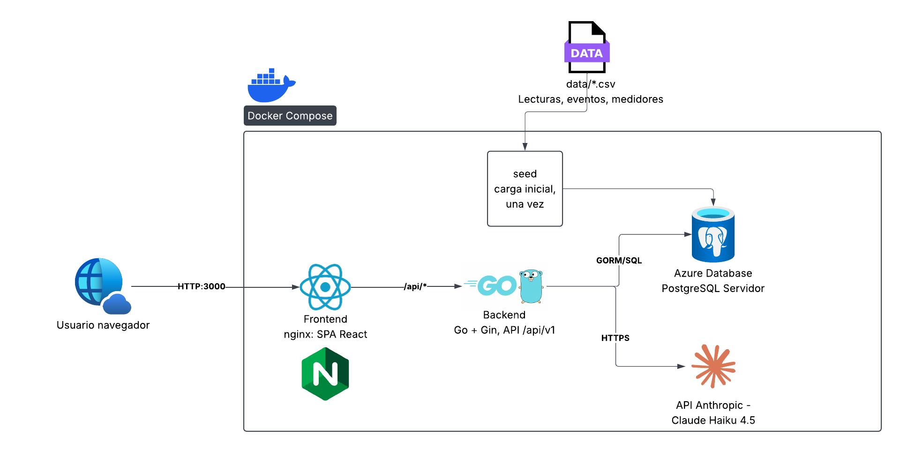
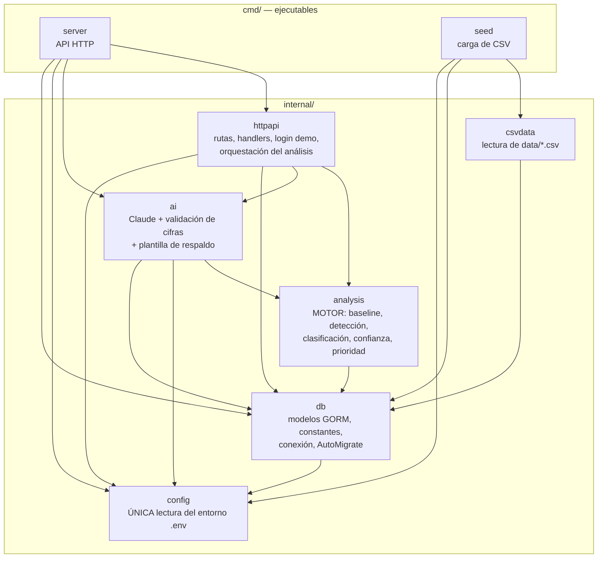
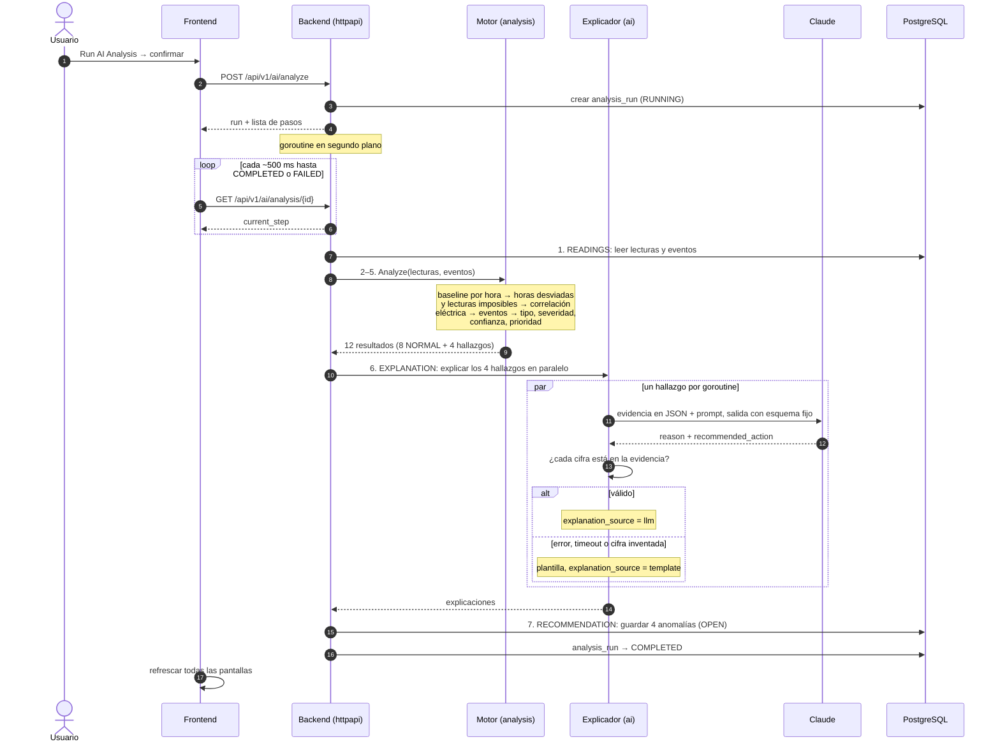
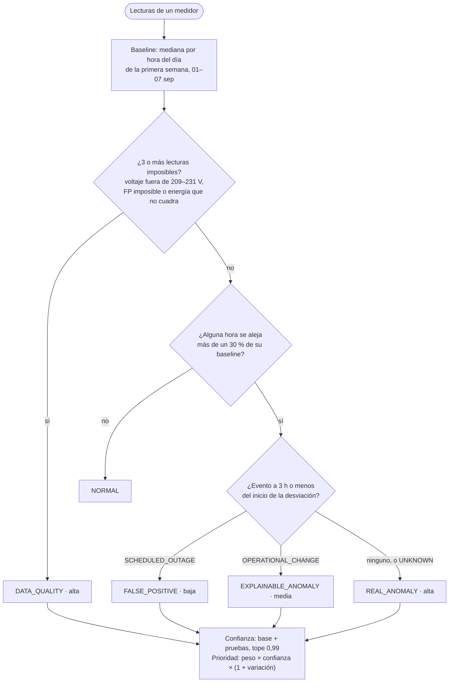
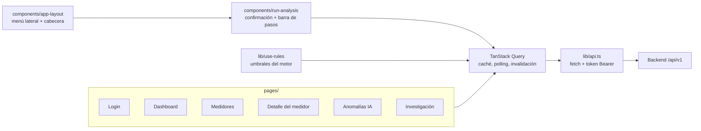
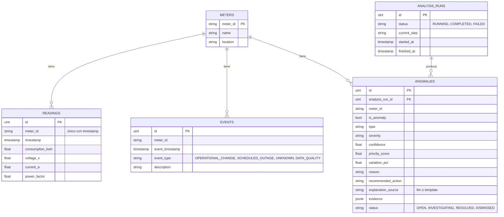

# Arquitectura — AI Energy Management Platform

---

## 1. Vista general

| Contenedor | Qué hace | Por qué así |
|---|---|---|
| **frontend** | nginx sirve la SPA compilada y reenvía `/api` al backend. | Mismo origen para el navegador: no hace falta CORS en producción. |
| **backend** | API REST en Go. Orquesta el análisis, ejecuta el motor y llama a Claude. | Un solo binario, sin puerto expuesto al host; solo se accede por nginx. |
| **postgres** | Guarda medidores, lecturas, eventos, análisis y anomalías. | Consultas agregadas (medianas, sumas) directamente en SQL. |
| **seed** | Carga los CSV al arrancar, solo si la base está vacía (`-if-empty`). | La carga de datos no es un endpoint: es una tarea de operación, no de usuario. |
| **Claude** | Servicio externo. Redacta `reason` y `recommended_action`. | Si no responde, la plataforma usa una plantilla y sigue funcionando. |

Orden de arranque: `postgres` (healthcheck) → `seed` → `backend` (healthcheck `/health`) → `frontend`.

En **desarrollo local**, Vite sirve el frontend en `:5173` y llama al backend en `:8080` con CORS (`FRONTEND_ORIGIN`). Postgres se publica en el puerto `5433` del host.

---

## 2. Backend: paquetes y dependencias

| Paquete | Responsabilidad | 
|---|---|
| `analysis` | Función pura `Analyze(lecturas, eventos) → resultados`. Todas las decisiones: tipo, severidad, confianza, prioridad y evidencia. | 
| `ai` | Recibe un resultado del motor y devuelve el texto. Interfaz `Explainer` con dos implementaciones: `LLMExplainer` (Claude) y `TemplateExplainer`. |
| `httpapi` | Rutas Gin bajo `/api/v1`, autenticación demo (`Bearer`), consultas SQL para las pantallas y el análisis paso a paso. | 
| `db` | Modelos GORM, constantes (estados, severidades, pasos) y conexión. | 
| `config` | Carga `backend/.env` y valida las variables obligatorias. |
| `csvdata` | Lee los CSV. Lo usan el seed y los tests del motor. | 

**Por qué el motor es una función pura:** se puede probar con los CSV reales sin levantar nada. El test de aceptación (`analysis/acceptance_test.go`) comprueba los 4 casos de la prueba cada vez que se ejecuta `go test ./...`.

**Una sola fuente para las reglas:** los umbrales (30 %, 209–231 V, ventana de 3 h, eventos que explican) viven en `analysis`. El frontend los pide a `GET /api/v1/analysis/rules` en vez de copiarlos.

---

## 3. Flujo de Run AI Analysis

- Cada paso espera `ANALYSIS_STEP_DELAY_MS` (700 ms por defecto) para que la barra de progreso se vea; sin esa pausa, los pasos 1–5 serían instantáneos.
- Solo se guardan los resultados distintos de `NORMAL`. Cada análisis crea filas nuevas, y las pantallas muestran siempre el último `COMPLETED`.
- Si el servidor se reinicia a mitad, al arrancar `db.FailInterruptedRuns` marca ese análisis como `FAILED` para que no quede colgado.

---

## 4. Motor: cómo decide

---

## 5. Frontend

- **Vite + React SPA:** la API es propia y no hay necesidad de SEO ni de renderizado en servidor.
- **TanStack Query** guarda en caché cada consulta. Al terminar un análisis, `run-analysis` invalida las consultas y todas las pantallas se actualizan solas.
- **Rutas con `lazy`:** cada página se descarga cuando se visita.
- **Sesión:** el token del login se guarda en el navegador; un `401` devuelve al login.

---

## 6. Modelo de datos

- El esquema se crea con `AutoMigrate` al conectar; no hay migraciones versionadas en el alcance del MVP.
- Las fechas se guardan como `timestamp` sin zona horaria, porque los CSV vienen en hora de planta, y el frontend las muestra tal cual.
- `evidence` (JSONB) guarda todo lo que el motor calculó para esa anomalía. Es lo que recibe Claude y lo que muestra "Evidencia completa".

---

## 7. API

Todas las rutas llevan el prefijo `/api/v1` y requieren `Authorization: Bearer <token>`, salvo el login. `GET /health` queda fuera del prefijo.

| Método | Ruta | Pantalla que la usa |
|---|---|---|
| POST | `/auth/login` | Login |
| GET | `/dashboard/summary` | Dashboard |
| GET | `/meters` | Dashboard, Medidores, Anomalías IA |
| GET | `/meters/{meterId}` | Detalle |
| GET | `/meters/{meterId}/readings` | Detalle, Investigación |
| GET | `/meters/{meterId}/baseline` | Detalle, Investigación |
| GET | `/events` | Detalle, Investigación |
| GET | `/analysis/rules` | Medidores, Detalle, Investigación |
| POST | `/ai/analyze` | Run AI Analysis |
| GET | `/ai/analysis/{id}` | Run AI Analysis (polling) |
| GET | `/anomalies` | Dashboard, Anomalías IA |
| GET | `/anomalies/{id}` | Detalle, Investigación |
| PATCH | `/anomalies/{id}` | Investigación (cambiar estado) |

---

## 8. Decisiones y siguientes pasos

| Decisión | Motivo |
|---|---|
| El motor decide y el LLM solo explica | Resultados reproducibles y auditables; la IA no puede inventar un problema. |
| Validación de cifras + plantilla de respaldo | La demo nunca depende de que la API de Claude responda. |
| Monolito modular | los paquetes ya separan responsabilidades |
| Análisis en goroutine + polling | Suficiente para un análisis de segundos; sin colas ni WebSockets. |

