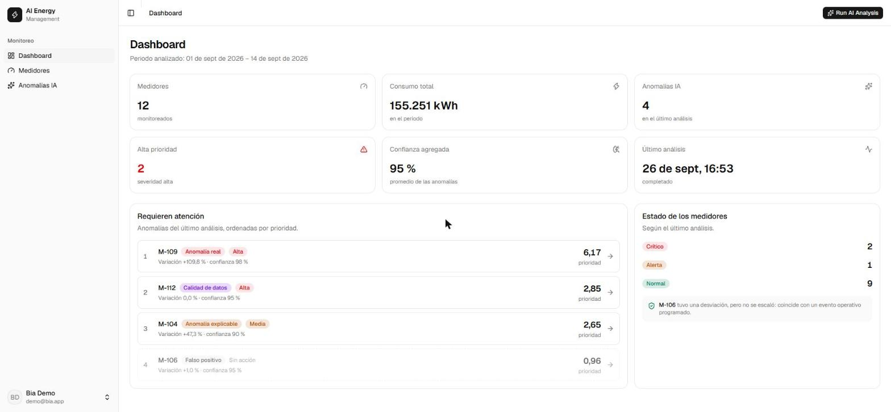
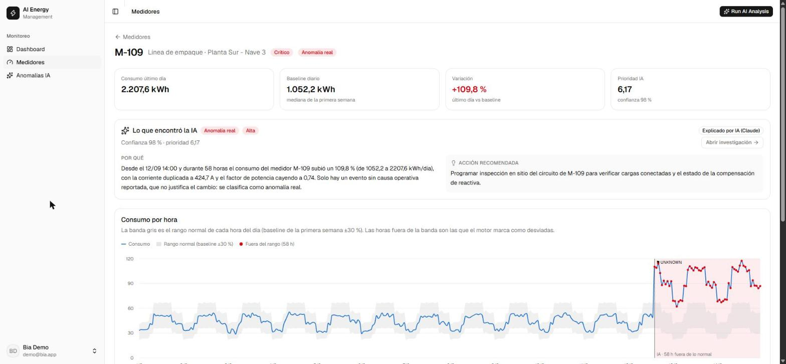
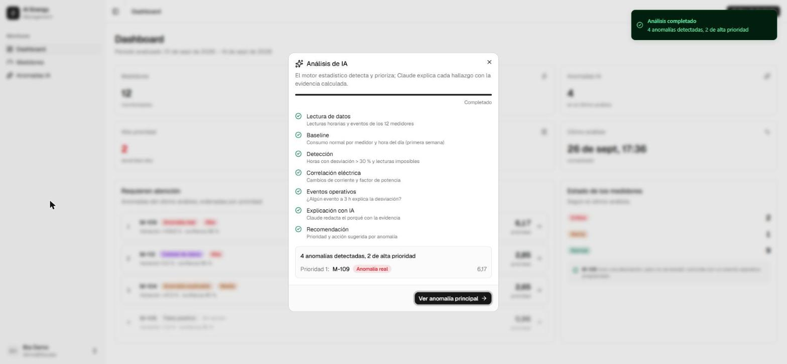
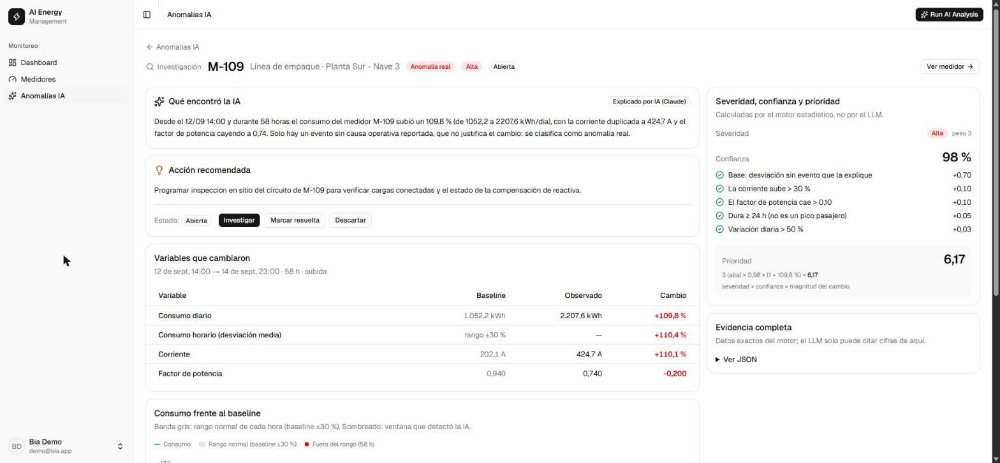

# AI Energy Management Platform

MVP para monitorear 12 medidores eléctricos y usar IA para **detectar, explicar, priorizar y recomendar acciones** sobre anomalías de consumo.

```
DATOS → ANÁLISIS → ANOMALÍA → EXPLICACIÓN → PRIORIZACIÓN → ACCIÓN
```

**Idea central: el motor estadístico decide y el LLM solo explica.** El tipo, la severidad, la confianza y la prioridad salen de código determinista y testeado en Go. el modelo de claude (Haiku 4.5) recibe esa evidencia ya calculada y la redacta para una persona. Si el LLM falla o cita una cifra que no está en la evidencia, se usa una plantilla. La demo nunca depende de que la API responda.

## Resultado

| Medidor | Diagnóstico | Severidad | Confianza | Variación | Prioridad | Por qué |
|---|---|---|---|---|---|---|
| **M-109** | Anomalía real | Alta | 98 % | +109,8 % | **6,17 (1.º)** | Consumo x2,1 desde el 12/09 14:00 durante 58 h, corriente +110 %, FP 0,94 → 0,74. Su único evento es `UNKNOWN`, que **no explica nada**. |
| **M-112** | Calidad de datos | Alta | 95 % | 0,0 % | 2,85 | 16 lecturas imposibles (201–241 V, FP con 3 valores repetidos) con consumo estable: el problema es la **medición**, no el consumo. |
| **M-104** | Anomalía explicable | Media | 90 % | +47,3 % | 2,65 | Escalón de +47 % que coincide con el evento *New production line activated*. |
| **M-106** | Falso positivo | Baja | 95 % | +1,0 % | 0,96 | Caída de 12 h que coincide exactamente con una parada programada: **no se escala**. |
| Los otros 8 | Normal | — | — | +/- 1,2 % | 0 | Desviación horaria máxima del 22 %, por debajo del umbral del 30 %. |

Resumen: **4 anomalías, 2 de prioridad alta.** Estos resultados están fijados en un test de aceptación que corre el motor sobre los CSV reales (`go test ./...`).

## Capturas

| Dashboard | Detalle de M-109 |
|---|---|
|  |  |
| **Run AI Analysis** | **Investigación** |
|  |  |

---

## Inicio rápido (Docker)

Requisito: Docker con Docker Compose.

```bash
cp backend/.env.example backend/.env
# Edita backend/.env: DB_PASSWORD, DEMO_PASSWORD y, opcionalmente, ANTHROPIC_API_KEY
docker compose --env-file backend/.env up -d --build
```

Abre **http://localhost:3000** y entra con `DEMO_EMAIL` / `DEMO_PASSWORD` de `backend/.env` (por defecto `demo@bia.app`).

- La primera vez, el servicio `seed` carga `data/*.csv` automáticamente.
- **Sin `ANTHROPIC_API_KEY`** todo funciona: las explicaciones las redacta una plantilla determinista. Con key, las redacta Claude.
- El dashboard empieza sin anomalías: pulsa **Run AI Analysis** en la cabecera.
- Reiniciar sus datos o análisis no borra nada: el `seed` solo carga si la base está vacía.

Para **volver al estado inicial de la demo** (recarga los CSV y borra los análisis):

```bash
docker compose --env-file backend/.env run --rm seed ./seed
```

El seed es un comando y no un endpoint a propósito: borra datos, así que no se expone por HTTP. Cargar datos es una tarea de operación, no una funcionalidad del producto.

<details>
<summary>Detalle de los servicios</summary>

```
Navegador ──► :3000  nginx
                      ├─ /        → SPA de React (compilada)
                      └─ /api/*   → proxy ──► backend :8080 ──► postgres :5432
              seed: carga los CSV una vez (solo si la base está vacía) y termina
```

- Arranque ordenado con *healthchecks*: `postgres` sano → `seed` terminado → `backend` sano → `frontend`.
- nginx sirve la SPA y hace de proxy de `/api`. Para el navegador es un solo origen: sin CORS y sin URL del backend fijada en el build.
- El backend no expone puertos al host. Postgres se publica en `5433` solo para desarrollo local.
- Imágenes multi-etapa (92 MB cada una). El `.env` nunca entra en una imagen (`.dockerignore`); las variables se pasan al ejecutar.

</details>

## Desarrollo local

Requisitos: Go 1.27+, Node 22+, Docker (solo para Postgres).

```bash
cp backend/.env.example backend/.env  
cp frontend/.env.example frontend/.env.local

docker compose --env-file backend/.env up -d postgres     # Postgres en localhost:5433

cd backend
go run ./cmd/seed        # carga los CSV (y borra análisis previos)
go run ./cmd/server      # API en http://localhost:8080

cd frontend
npm install
npm run dev              # http://localhost:5173
```

### Variables de entorno (`backend/.env`)

| Variable | Obligatoria | Descripción |
|---|---|---|
| `DB_HOST`, `DB_PORT`, `DB_USER`, `DB_PASSWORD`, `DB_NAME` | Sí | Conexión a Postgres (local: `localhost:5433`) |
| `DEMO_EMAIL`, `DEMO_PASSWORD` | Sí | Usuario del login demo (`DEMO_NAME` es opcional) |
| `ANTHROPIC_API_KEY` | No | Vacía → explicaciones por plantilla |
| `ANTHROPIC_MODEL` | No | Cualquier modelo de Claude. Por defecto `claude-haiku-4-5` |
| `AI_TIMEOUT_SECONDS` | No | Tiempo máximo por explicación (60) |
| `ANALYSIS_STEP_DELAY_MS` | No | Pausa entre los pasos de *Run AI Analysis* para que la barra se vea (700) |
| `APP_PORT`, `FRONTEND_ORIGIN`, `GIN_MODE`, `DATA_DIR`, `WEB_PORT` | No | Puerto de la API, origen CORS, modo de Gin, carpeta de CSV, puerto web en Docker |

Solo `internal/config` lee el entorno. Si falta una variable obligatoria, el programa no arranca y lista las que faltan.

---

## Arquitectura

Diagramas de contenedores, paquetes, flujo del análisis, motor y modelo de datos en [`ARCHITECTURE.md`](ARCHITECTURE.md).

| Capa | Tecnología |
|---|---|
| Backend | Go 1.27 + Gin, monolito modular |
| Base de datos | PostgreSQL 17 + GORM (`AutoMigrate`); SQL a mano (`db.Raw`) para agregados |
| IA | SDK oficial `anthropic-sdk-go`, Claude Haiku 4.5 (configurable), salida JSON por esquema |
| Frontend | Vite + React 19 + TypeScript, React Router 7, TanStack Query 5, Tailwind 4, shadcn/ui, Recharts 3 |
| Infra | Docker Compose (Postgres, seed, backend, nginx) |

```
backend/
  cmd/server/          API HTTP (Gin)
  cmd/seed/            carga data/*.csv (idempotente; -if-empty para Docker)
  internal/analysis/   motor determinista: baseline, detección, clasificación, confianza, prioridad (+ tests)
  internal/ai/         explicador: Claude + validación de cifras + plantilla de respaldo (+ tests)
  internal/httpapi/    handlers, CORS, login demo, orquestación del análisis (+ tests)
  internal/db/         modelos GORM, constantes de estado, conexión
  internal/config/     única lectura de variables de entorno
  internal/csvdata/    lectura de los CSV (seed y tests)
frontend/src/
  pages/               Login, Dashboard, Medidores, Detalle, Anomalías IA, Investigación
  components/          layout, Run AI Analysis, gráficas, badges de estado
  lib/                 cliente de la API y tipos, sesión, formato (es-CO, fechas UTC)
data/                  readings.csv, events.csv, meters.csv (nombres inventados: la prueba no los incluye)
docs/                  analysis_prototype.py (prototipo de calibración)
```

## Cómo funciona el motor de anomalías

Está en `backend/internal/analysis`. Es una función pura, `Analyze(lecturas, eventos) → resultados`, sin base de datos ni HTTP, y por eso se prueba directamente con los CSV.

1. **Baseline.** Mediana del consumo por medidor **y hora del día** en la primera semana (01–07 sep). Se calcula por hora porque las plantas tienen un perfil diario marcado; se usa la mediana porque un pico aislado no la mueve.
2. **Detección.** Una hora está desviada si `|kWh / baseline_hora − 1| > 30 %`. Los medidores normales llegan como máximo al 22 %, así que el umbral deja margen.
3. **Calidad de datos.** Una lectura es imposible si el voltaje está fuera de 209–231 V (mas o menos 5 % sobre 220 V), si el FP es > 1 o ≤ 0, o si la energía no cuadra con `V·I·FP` (desvío > 50 % respecto al ratio propio del medidor).
4. **Eventos.** Un evento "coincide" si está a +/- 3 h del inicio de la desviación. **Solo `OPERATIONAL_CHANGE` y `SCHEDULED_OUTAGE` explican**: un evento `UNKNOWN` se reporta, pero no justifica nada.
5. **Clasificación, en este orden:**
   1. ≥ 3 lecturas imposibles → `DATA_QUALITY` (alta)
   2. Sin horas desviadas → `NORMAL`
   3. Coincide con `SCHEDULED_OUTAGE` → `FALSE_POSITIVE` (baja)
   4. Coincide con `OPERATIONAL_CHANGE` → `EXPLAINABLE_ANOMALY` (media)
   5. En cualquier otro caso → `REAL_ANOMALY` (alta)
6. **Confianza aditiva, basada en evidencia** (tope 0,99). Por ejemplo, para una anomalía real:

   | Factor | Puntos |
   |---|---|
   | Base: desviación sin evento que la explique | +0,70 |
   | La corriente sube > 30 % (el aumento es eléctrico, no un error) | +0,10 |
   | El factor de potencia cae > 0,10 | +0,10 |
   | Dura ≥ 24 h (no es un pico pasajero) | +0,05 |
   | Variación diaria > 50 % | +0,03 |

   El motor devuelve estos factores dentro de la evidencia, y la pantalla de Investigación los muestra: la confianza no es un número mágico.
7. **Prioridad** = `peso_severidad (3/2/1) × confianza × (1 + |variación %| / 100)`. Para M-109: `3 × 0,98 × 2,098 = 6,17`.

La **variación** mostrada compara el último día con la mediana diaria del baseline. Una comparación semana contra semana diluye un cambio que empieza a mitad de semana (M-109 daría solo +38,7 %).

## IA y explicabilidad

`backend/internal/ai` recibe el resultado del motor y produce `reason` y `recommended_action`:

- **Salida estructurada:** el esquema JSON se impone con `output_config.format`, así Claude devuelve exactamente `{reason, recommended_action}`.
- **Validación de cifras:** cada número del texto debe poder rastrearse hasta la evidencia (se admite redondear 110,1 → "110"). Si Claude escribe un número que no está, **se descarta** su texto.
- **Plantilla de respaldo** ante cualquier fallo: API caída, timeout, rechazo, respuesta cortada, JSON inválido o cifra inventada. Cada anomalía guarda `explanation_source` (`llm` o `template`) y la interfaz lo muestra.
- **Prompt:** el LLM no puede cambiar la clasificación; se le pide un máximo de 2 frases, en español, sin códigos internos.
- **Cualquier modelo de Claude** (`ANTHROPIC_MODEL`). La petición se arma según lo que admite cada familia (`internal/ai/models.go`): Haiku 4.5 recibe `temperature: 0`; Opus 5 recibe `effort: low` y `fallbacks: "default"` (rechaza `temperature`); un modelo desconocido recibe la petición mínima. Así cambiar de modelo nunca provoca un 400 silencioso.
- **Haiku 4.5 por defecto:** comparado con Opus 5 en el mismo análisis, redactó igual de bien (4/4 aceptadas, 0 cifras inventadas), en ~4,8 s frente a ~8 s y ~5 veces más barato. Para textos de 2 frases el modelo grande no aporta.
- Las 4 explicaciones se piden **en paralelo** (goroutines) durante el paso EXPLANATION.

**Run AI Analysis** (`POST /api/v1/ai/analyze`) crea un análisis y lo ejecuta en una goroutine que recorre 7 pasos (READINGS → BASELINE → DETECTION → CORRELATION → EVENTS → EXPLANATION → RECOMMENDATION). El frontend consulta el avance cada 500 ms. Si el servidor se reinicia a mitad, el análisis queda marcado como `FAILED` al arrancar, en lugar de colgado.

## API

Todas las rutas llevan el prefijo **`/api/v1`**, salvo `GET /health`. El enunciado las lista sin prefijo; se añadió para poder versionar la API. Todas exigen `Authorization: Bearer <token>`, salvo el login.

| Método | Ruta | Descripción |
|---|---|---|
| POST | `/auth/login` | `{email, password}` → `{token, user}` (login demo) |
| GET | `/dashboard/summary` | KPIs: medidores, consumo total, anomalías, alta prioridad, confianza media, último análisis |
| GET | `/meters` | Los 12 medidores con consumo, baseline, variación y estado del último análisis |
| GET | `/meters/{meterId}` | Un medidor |
| GET | `/meters/{meterId}/readings` | 336 lecturas horarias |
| GET | `/meters/{meterId}/baseline` | Baseline por hora del día con la banda +/- 30 % (la que usa el motor) |
| GET | `/events?meter_id=` | Eventos operativos |
| GET | `/analysis/rules` | Umbrales del motor (30 %, 209–231 V, +/- 3 h, pesos…). El frontend los usa en lugar de copiarlos |
| POST | `/ai/analyze` | Inicia un análisis (202 + id) |
| GET | `/ai/analysis/{id}` | Estado y paso actual del análisis |
| GET | `/anomalies?meter_id=&status=&severity=` | Anomalías del último análisis, por prioridad |
| GET | `/anomalies/{id}` | Detalle con la evidencia |
| PATCH | `/anomalies/{id}` | `{status}`: `OPEN` \| `INVESTIGATING` \| `RESOLVED` \| `DISMISSED` |

Ejemplo de anomalía:

```json
{
  "meter_id": "M-109",
  "anomaly": true,
  "type": "REAL_ANOMALY",
  "severity": "HIGH",
  "confidence": 0.98,
  "priority_score": 6.17,
  "variation_pct": 109.8,
  "baseline_kwh_day": 1052.2,
  "current_kwh_day": 2207.6,
  "reason": "Desde el 12/09 14:00 y durante 58 horas el consumo subió un 109,8 % …",
  "recommended_action": "Programar inspección en sitio del circuito de M-109 …",
  "explanation_source": "llm",
  "status": "OPEN",
  "evidence": { "deviation": { "hours_affected": 58, "current_change_pct": 110.1, "…": "…" },
                "confidence_factors": [{ "label": "La corriente sube > 30 %", "points": 0.1, "applied": true }] }
}
```

## Tests

```bash
cd backend && go test ./...        
cd frontend && npm run lint && npm run typecheck && npm run build
```

| Test | Qué garantiza |
|---|---|
| `analysis/acceptance_test.go` | Con los CSV reales: la tabla de resultados completa, M-109 primero, 8 NORMAL, 4 anomalías / 2 altas, factores que suman la confianza |
| `analysis/classify_test.go` | Un escenario sintético por regla, incluidas las trampas: evento `UNKNOWN`, evento fuera de mas o menos 3 h, 2 lecturas malas (bajo el umbral), calidad de datos antes que desviación. Más prioridad, redondeo como Python y mediana. |
| `ai/llm_test.go` | Contra una API de Claude simulada (`httptest`): respuesta válida, cifra inventada, JSON roto, refusal, max_tokens, error 500 y timeout. Salvo la válida, todos caen a la plantilla. También verifica lo que se envía a la API. |
| `ai/template_test.go` | La plantilla cita las cifras correctas y una acción coherente por tipo |
| `httpapi/auth_test.go` | Login, token obligatorio y preflight CORS |

Los tests se verificaron **rompiendo el código a propósito**: por ejemplo, haciendo que cualquier evento explique la anomalía, o con un umbral del 20 %. En ambos casos fallan.

## Decisiones técnicas

- **Motor determinista + LLM explicador**, y no un LLM clasificando lecturas crudas. Así los resultados son reproducibles, no se inventan cifras, el análisis es barato e instantáneo
- **Prototipo en Python primero.** `docs/analysis_prototype.py` sirvió para explorar los datos y calibrar los umbrales con pandas. La implementación de producción es Go, y el test de aceptación garantiza que ambos dan los mismos resultados. El redondeo replica `round()` de Python.
- **Monolito modular en Go.** Microservicios serían sobreingeniería para un MVP; los paquetes separados permiten testear el motor aislado.
- **Fechas en UTC de punta a punta.** El CSV trae hora local de planta sin zona horaria: se guarda como `timestamp` sin zona y el frontend la formatea en UTC, para que "12/09 14:00" sea la hora del CSV en cualquier navegador.
- **Una sola fuente de verdad para las reglas:** el frontend no copia umbrales (30 %, 209–231 V…); los pide a `GET /analysis/rules`, que los lee de las mismas constantes del motor.
- **Colores de estado como tokens semánticos** (`success`, `warning`, `info`, `data-quality`) en el tema, con variantes del `Badge`. El rojo se reserva para lo que requiere acción.

## Limitaciones y siguientes pasos

- **Auth real:** usuarios en base de datos, contraseñas con hash, tokens con expiración y cookies `httpOnly`. Hoy es un usuario demo y un token que cambia en cada reinicio.
- **Baseline dinámico:** hoy es la primera semana fija. En producción sería una ventana móvil que excluya anomalías confirmadas (por ejemplo, actualizar el baseline de M-104 tras validar la nueva línea).
- **Conservar el estado de gestión** entre análisis: hoy cada análisis crea anomalías nuevas en `OPEN`.
- **Observabilidad:** logs estructurados, métricas y trazas de las llamadas al LLM (latencia, tasa de caída a plantilla).
- **Servidor MCP** para que un agente consulte medidores y anomalías.

## Desarrollo asistido por IA

El proyecto se construyó con Claude Code como asistente: planificación, escritura del código Go y Claude Design para el apoyo en frontend para mockups y componentes.
